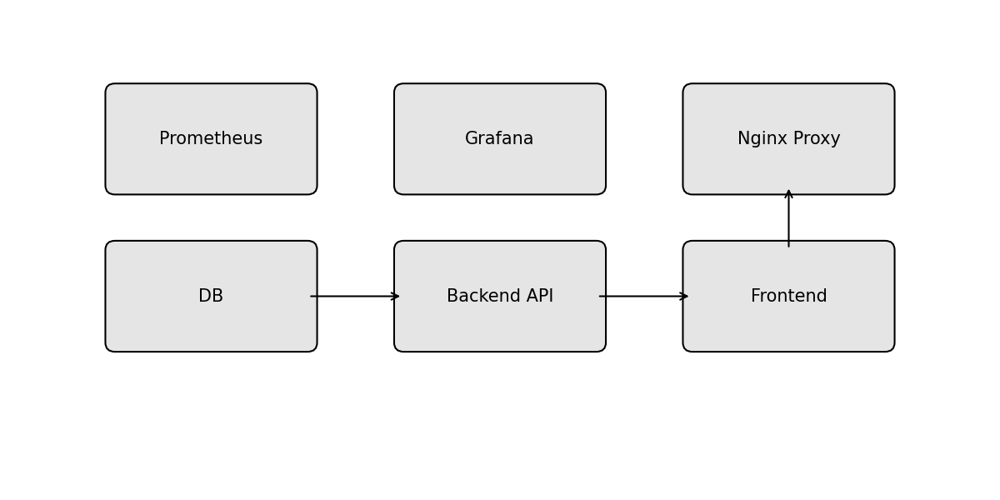

# Architecture Overview

The infrastructure provisioned by this project is composed of several cooperating components.  The diagram below illustrates the high‑level topology:

## Components

* **Database (PostgreSQL)** – Stores persistent application data.  Deployed as a Docker container and exposed on the internal `backend` network.
* **Backend API** – Business logic layer packaged as a container (placeholder image) that connects to the database and exposes REST/GraphQL endpoints.
* **Frontend** – Client‑side application (e.g. React or Vue) served via Nginx.  Connects to the API and is also packaged as a container.
* **Nginx Proxy** – Routes external HTTP requests to the frontend container and can be extended to handle TLS termination or API gateway functionality.
* **Prometheus** – Collects metrics from the application and infrastructure.  Configured via `docker/prometheus/prometheus.yml`.
* **Grafana** – Provides dashboards for visualising metrics collected by Prometheus.

## Networking

Docker Compose defines three internal networks: `backend`, `frontend` and `monitoring` to isolate traffic between components.  Only the Nginx container exposes port 80 to the host for HTTP access to the application.  Prometheus and Grafana expose ports `9090` and `3000` respectively for monitoring access.

## Infrastructure Provisioning

Terraform is used to create the underlying virtual machines on Proxmox (or another cloud/hypervisor provider) using cloud‑init templates.  Sensitive variables such as API credentials and SSH keys are not stored in version control; instead they are passed in via `.tfvars` files or environment variables.

## Configuration Management

Ansible roles define idempotent tasks to configure the operating system, install system packages, deploy configuration files and start services.  The `common` role applies baseline settings to all hosts, while the `web` and `db` roles install and configure Nginx and PostgreSQL respectively.

## Application Deployment

The application stack is containerised using Docker.  `docker-compose.yml` defines services for the database, API, frontend, reverse proxy and monitoring stack.  Environment variables are used to configure service connections, and volumes ensure persistent storage for the database.